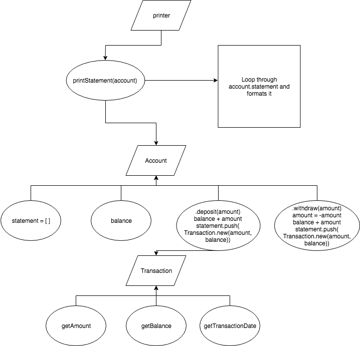

# Bank Tech Test

## by George Drayson

## Description

This was a practice tech test as part of the Makers Academy course. My code contains 4 classes:
- Account - Has a balance and a statement, which is filled with transaction objects
- Transaction - Knows the credit, debit, transaction date and  balance at that time
- DateFormatter - Formats the date for the transaction class
- Printer - prints the statement

I chose to make a transaction class because it allowed the account class to have only one responsibility.
The date formatting class was a way of encapsulating the date logic from the transaction class.


### Requirements
 - You should be able to interact with your code via a REPL like IRB or the JavaScript console. (You don't need to implement a command line interface that takes input from STDIN.)
 - Deposits, withdrawal.
 - Account statement (date, amount, balance) printing.
 - Data can be kept in memory (it doesn't need to be stored to a database or anything).

### Acceptance criteria

- Given a client makes a deposit of 1000 on 10-01-2012
- And a deposit of 2000 on 13-01-2012
- And a withdrawal of 500 on 14-01-2012
- When she prints her bank statement
- Then she would see:
```
date || credit || debit || balance
14/01/2012 || || 500.00 || 2500.00
13/01/2012 || 2000.00 || || 3000.00
10/01/2012 || 1000.00 || || 1000.00
```
## Get started

Clone this repository. Then, type:
```
open SpecRunner.html
```
Then open the Chrome Dev console to interact with the code.

## Domain model:



## User stories

```
As user,
So that I can put money into my account,
I would like to deposit.

As user,
So that I can take money from my account,
I would like to withdraw.

As user,
So that I can see all my account activity,
I would like to see my statement printed neatly.

As user,
So that I can when I made a deposit/withdrawal,
I would like to see the date of every transaction.

As user,
So that I can how much I deposited/withdrew,
I would like to see the amount of every transaction.

As user,
So that I can see my money after every deposit/withdrawal,
I would like to my balance after each transaction.
```

## Built With

* [JavaScript](https://www.javascript.com/) - Language
* [Jasmine](https://jasmine.github.io/) - The testing framework
* [Atom](https://atom.io/) - Text editor
